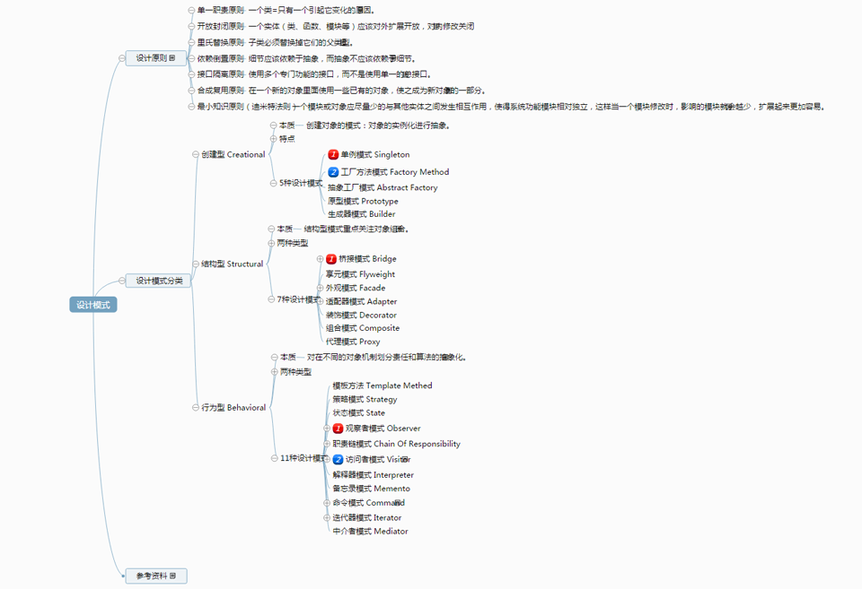

设计模式
==================================================


[](docs/img/design_patterns_src.png)


## 目录列表

- 创建型 creational
    - [单例模式 ```Singleton```](docs/creational/Singleton.md)
    - [工厂方法模式 ```Factory Method```](docs/creational/FactoryMethod.md)
    - [简单工厂模式 ```Simple Factory *```](docs/creational/SimpleFactory.md)
    - [抽象工厂模式 ```Abstract Factory```](docs/creational/AbstractFactory.md)
    - [原型模式 ```Prototype```](docs/creational/Prototype.md)
    - [生成器模式 ```Builder```](docs/creational/Builder.md)

- 结构型 structural
    - [桥接模式 ```Bridge```](docs/structural/Bridge.md)
    - [享元模式 ```Flyweight```](docs/structural/Flyweight.md) 
    - [外观模式 ```Facade```](docs/structural/Facade.md)
    - [适配器模式 ```Adapter```](docs/structural/Adapter.md)
    - [装饰模式 ```Decorator```](docs/structural/Decorator.md)
    - [组合模式 ```Composite```](docs/structural/Composite.md)
    - [代理模式 ```Proxy```](docs/structural/Proxy.md)

- 行为型 behavioral
    - [模板方法 ```Template Methed```](docs/behavioral/TemplateMethed.md)
    - [策略模式 ```Strategy```](docs/behavioral/Strategy.md)
    - [状态模式 ```State```](docs/behavioral/State.md)
    - [观察者模式 ```Observer```](docs/behavioral/Observer.md)
    - [职责链模式 ```Chain Of Responsibility```](docs/behavioral/ChainOfResponsibility.md)
    - [访问者模式 ```Visitor```](docs/behavioral/Visitor.md)
    - [解释器模式 ```Interpreter```](docs/behavioral/Interpreter.md)
    - [备忘录模式 ```Memento```](docs/behavioral/Memento.md)
    - [命令模式 ```Command```](docs/behavioral/Command.md)
    - [迭代器模式 ```Iterator```](docs/behavioral/Iterator.md)
    - [中介者模式 ```Mediator```](docs/behavioral/Mediator.md)


## 附录
* 线上工具
    * [UML关系图](http://www.jianshu.com/p/53810581d715)
    * [设计模式之UML工具](http://www.jianshu.com/p/31d22b55ea45)
* 参考资料
    * [工厂设计模式](docs/factory.md)
    * [设计模式六大原则](docs/principles.md)


> 关于我 [https://github.com/dodosss/design_patterns](https://github.com/dodosss/design_patterns)
> 讨论留言
