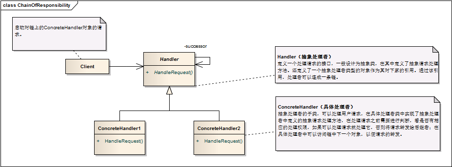

职责链模式 ```Chain Of Responsibility``` 
==================================================


## 真实案例

多账号付款。假设，您的账户里有三种付款方式可供选择(A、B 和 C)。但额度各不一样，A 有 100$，B 有 300$，C 有 1000$。支付优先级顺序是从 A 到 C。当您尝试购买价格为 210$ 的东西时，用责任链来处理，会先去看 A 方式可否搞定，如果搞不定，就再去用 B，如果依然搞不定，再去用 C。直到找到合适的方式。这里的 A，B 和 C 构成的链条，以及这样的现象就是责任链。


## 模式定义

责任链模式：避免请求发送者与接收者耦合在一起，让多个对象都有可能接收请求，将这些对象连接成一条链，并且沿着这条链传递请求，直到有对象处理它为止。


## 模式UML




## 模式角色

- Handler（抽象处理者）

    定义一个处理请求的接口，一般设计为抽象类，由于不同的具体处理者处理请求的方式不同，因此在其中定义了抽象请求处理方法。因为每一个处理者的下家还是一个处理者，因此在抽象处理者中定义了一个抽象处理者类型的对象作为其对下家的引用。通过该引用，处理者可以连成一条链。（是不是有点像C语言的链表结构呢？）

- ConcreteHandler（具体处理者）

    抽象处理者的子类，可以处理用户请求，在具体处理者类中实现了抽象处理者中定义的抽象请求处理方法，在处理请求之前需要进行判断，看是否有相应的处理权限，如果可以处理请求就处理它，否则将请求转发给后继者；在具体处理者中可以访问链中下一个对象，以便请求的转发。


## 使用场景

有多个对象可以处理同一个请求，具体哪个对象处理该请求待运行时刻再确定，客户端只需将请求提交到链上，而无须关心请求的处理对象是谁以及它是如何处理的。

在不明确指定接收者的情况下，向多个对象中的一个提交一个请求。

可动态指定一组对象处理请求，客户端可以动态创建职责链来处理请求，还可以改变链中处理者之间的先后次序。


## 代码实现

[职责链模式](../../project/lib/src/main/java/com/dodo/patterns/behavioral/chainofresponsibility/)