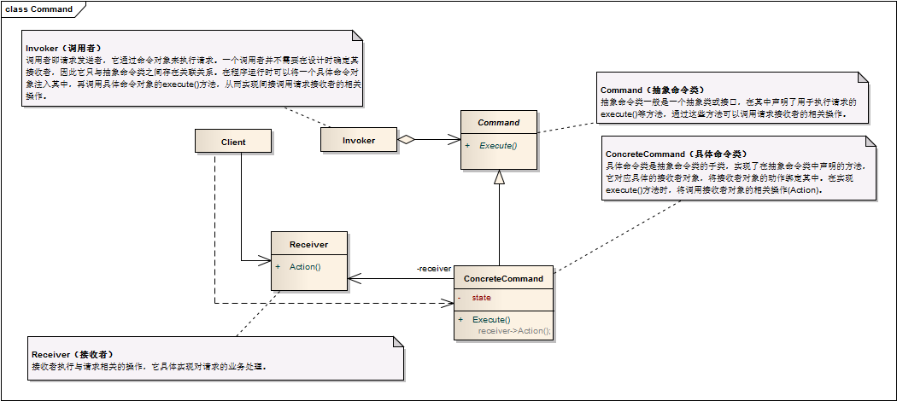

命令模式 ```Command``` 
==================================================


## 真实案例

一个典型的例子是，在饭馆点菜。你(客户)要求服务员(调用者)上一些食物(命令)，然后服务员将命令简短的传达给厨师(接收者)，厨师拥有做菜的必要知识与技能。另一个例子，你(客户)用遥控器(调用者)来切换(命令)电视(接收者)节目。


## 模式定义

将一个请求封装为一个对象，从而让我们可用不同的请求对客户进行参数化；对请求排队或者记录请求日志，以及支持可撤销的操作。命令模式是一种对象行为型模式，其别名为动作(Action)模式或事务(Transaction)模式。


## 模式UML




## 模式角色

- Command（抽象命令类）

    抽象命令类一般是一个抽象类或接口，在其中声明了用于执行请求的execute()等方法，通过这些方法可以调用请求接收者的相关操作。

- ConcreteCommand（具体命令类）

    具体命令类是抽象命令类的子类，实现了在抽象命令类中声明的方法，它对应具体的接收者对象，将接收者对象的动作绑定其中。在实现execute()方法时，将调用接收者对象的相关操作(Action)。

- Invoker（调用者）

    调用者即请求发送者，它通过命令对象来执行请求。一个调用者并不需要在设计时确定其接收者，因此它只与抽象命令类之间存在关联关系。在程序运行时可以将一个具体命令对象注入其中，再调用具体命令对象的execute()方法，从而实现间接调用请求接收者的相关操作。

- Receiver（接收者）

    接收者执行与请求相关的操作，它具体实现对请求的业务处理。


## 使用场景

系统需要将请求调用者和请求接收者解耦，使得调用者和接收者不直接交互。请求调用者无须知道接收者的存在，也无须知道接收者是谁，接收者也无须关心何时被调用。

系统需要在不同的时间指定请求和执行请求。一个命令对象和请求的初始调用者可以有不同的生命期，换言之，最初的请求发出者可能已经不在了，而命令对象本身仍然是活动的，可以通过该命令对象去调用请求接收者，而无须关心请求调用者的存在性，可以通过请求日志文件等机制来具体实现。

系统需要支持命令的撤销(Undo)操作和恢复(Redo)操作。

系统需要将一组操作组合在一起形成宏命令。


## 代码实现

[命令模式](../../project/lib/src/main/java/com/dodo/patterns/behavioral/command/)
