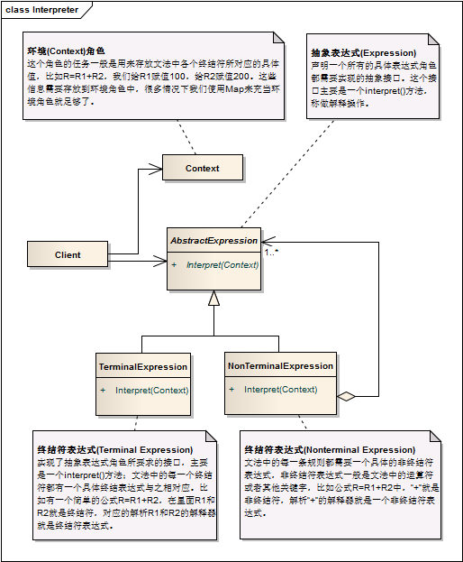

解释器模式 ```Interpreter``` 
==================================================


## 真实案例

无

## 模式定义

定义一个语言的文法，并且建立一个解释器来解释该语言中的句子，这里的“语言”是指使用规定格式和语法的代码。解释器模式是一种类行为型模式。


## 模式UML




## 模式角色

- 抽象表达式(Expression)

    声明一个所有的具体表达式角色都需要实现的抽象接口。这个接口主要是一个interpret()方法，称做解释操作。

- 终结符表达式(Terminal Expression)

    实现了抽象表达式角色所要求的接口，主要是一个interpret()方法；文法中的每一个终结符都有一个具体终结表达式与之相对应。比如有一个简单的公式R=R1+R2，在里面R1和R2就是终结符，对应的解析R1和R2的解释器就是终结符表达式。

- 非终结符表达式(Nonterminal Expression)

    文法中的每一条规则都需要一个具体的非终结符表达式，非终结符表达式一般是文法中的运算符或者其他关键字，比如公式R=R1+R2中，“+”就是非终结符，解析“+”的解释器就是一个非终结符表达式。

- 环境(Context)角色

    这个角色的任务一般是用来存放文法中各个终结符所对应的具体值，比如R=R1+R2，我们给R1赋值100，给R2赋值200。这些信息需要存放到环境角色中，很多情况下我们使用Map来充当环境角色就足够了。


## 使用场景

有一个简单的语法规则，比如一个sql语句，如果我们需要根据sql语句进行rm转换，就可以使用解释器模式来对语句进行解释。

一些重复发生的问题，比如加减乘除四则运算，但是公式每次都不同，有时是a+b-c*d，有时是a*b+c-d等，公式千变万化，但是都是由加减乘除四个非终结符来连接的，这时我们就可以使用解释器模式。

解释器模式在实际的系统开发中使用的很少，因为他会引起效率、性能以及维护等问题。

 
## 代码实现

[解释器模式](../../project/lib/src/main/java/com/dodo/patterns/behavioral/interpreter/)
