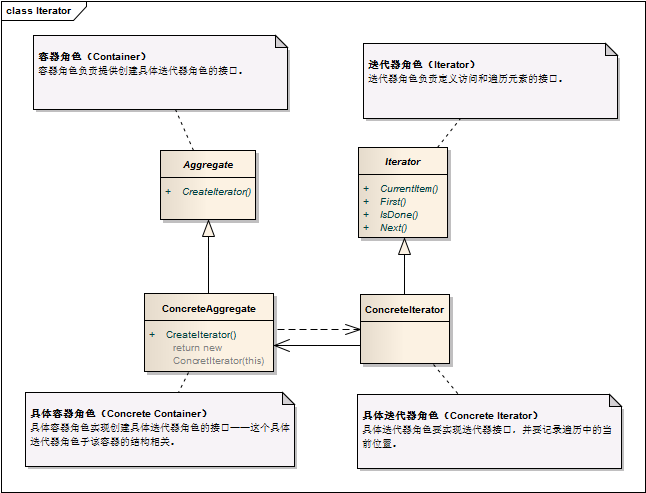

迭代器模式 ```Iterator``` 
==================================================


## 真实案例

老式的收音机是迭代器的一个好例子, 用户可以从任意频道开始, 通过点击"下一个"或"上一个"按钮, 来浏览响应的频道. 也可以用 MP3 播放器和电视机来举例, 你同样可以通过"向前"和"向后"按钮来连续切换频道. 换句话说, 它们都提供了一个接口来遍历各个频道, 歌曲或电台.


## 模式定义

提供一种方法来访问聚合对象，而不用暴露这个对象的内部表示，其别名为游标(Cursor)。迭代器模式是一种对象行为型模式。


## 模式UML



## 模式角色

- 迭代器角色（Iterator）

    迭代器角色负责定义访问和遍历元素的接口。

- 具体迭代器角色（Concrete Iterator）

    具体迭代器角色要实现迭代器接口，并要记录遍历中的当前位置。

- 容器角色（Container）

    容器角色负责提供创建具体迭代器角色的接口。

- 具体容器角色（Concrete Container）

    具体容器角色实现创建具体迭代器角色的接口——这个具体迭代器角色于该容器的结构相关。


迭代器模式中应用了工厂方法模式，抽象迭代器对应于抽象产品角色，具体迭代器对应于具体产品角色，抽象聚合类对应于抽象工厂角色，具体聚合类对应于具体工厂角色。
 

## 使用场景

 访问一个聚合对象的内容而无需暴露它的内部表示。

支持对聚合对象的多种遍历。

为遍历不同的聚合结构提供一个统一的接口(即, 支持多态迭代)。

迭代器模式是与集合共生共死的，一般来说，我们只要实现一个集合，就需要同时提供这个集合的迭代器，就像Java中的Collection，List、Set、Map等，这些集合都有自己的迭代器。假如我们要实现一个这样的新的容器，当然也需要引入迭代器模式，给我们的容器实现一个迭代器。但是，由于容器与迭代器的关系太密切了，所以大多数语言在实现容器的时候都给提供了迭代器，并且这些语言提供的容器和迭代器在绝大多数情况下就可以满足我们的需要，所以现在需要我们自己去实践迭代器模式的场景还是比较少见的，我们只需要使用语言中已有的容器和迭代器就可以了。

 
## 代码实现

[迭代器模式](../../project/lib/src/main/java/com/dodo/patterns/behavioral/iterator/)