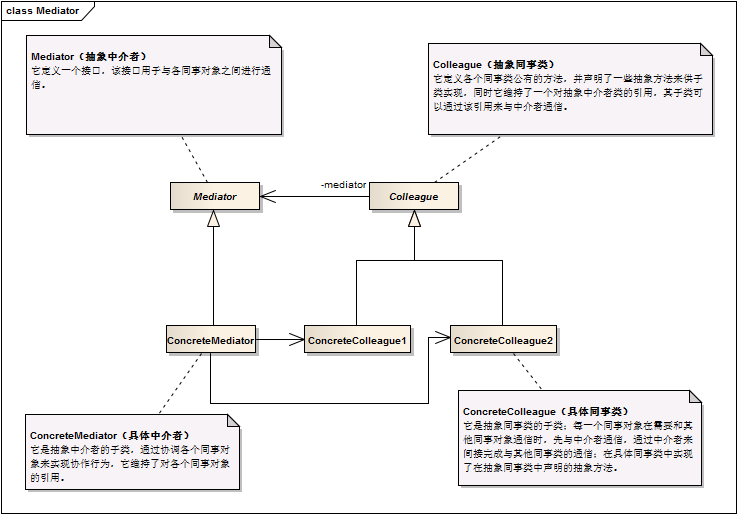

中介者模式 ```Mediator``` 
==================================================


## 真实案例

典型案例是, 你通过手机给人打电话, 你和对方的通讯并非直接送达的, 而是需要通过中间的网络运营商. 这个案例中, 网络运营商就是中介者.


## 模式定义

用一个中介对象（中介者）来封装一系列的对象交互，中介者使各对象不需要显式地相互引用，从而使其耦合松散，而且可以独立地改变它们之间的交互。中介者模式又称为调停者模式，它是一种对象行为型模式。


## 模式UML




## 模式角色

- Mediator（抽象中介者）

    它定义一个接口，该接口用于与各同事对象之间进行通信。

- ConcreteMediator（具体中介者）

    它是抽象中介者的子类，通过协调各个同事对象来实现协作行为，它维持了对各个同事对象的引用。

- Colleague（抽象同事类）

    它定义各个同事类公有的方法，并声明了一些抽象方法来供子类实现，同时它维持了一个对抽象中介者类的引用，其子类可以通过该引用来与中介者通信。

- ConcreteColleague（具体同事类）

    它是抽象同事类的子类；每一个同事对象在需要和其他同事对象通信时，先与中介者通信，通过中介者来间接完成与其他同事类的通信；在具体同事类中实现了在抽象同事类中声明的抽象方法。


## 使用场景

系统中对象之间存在复杂的引用关系，系统结构混乱且难以理解。

一个对象由于引用了其他很多对象并且直接和这些对象通信，导致难以复用该对象。

想通过一个中间类来封装多个类中的行为，而又不想生成太多的子类。可以通过引入中介者类来实现，在中介者中定义对象交互的公共行为，如果需要改变行为则可以增加新的具体中介者类。

 
## 代码实现

[中介者模式](../../project/lib/src/main/java/com/dodo/patterns/behavioral/mediator/)