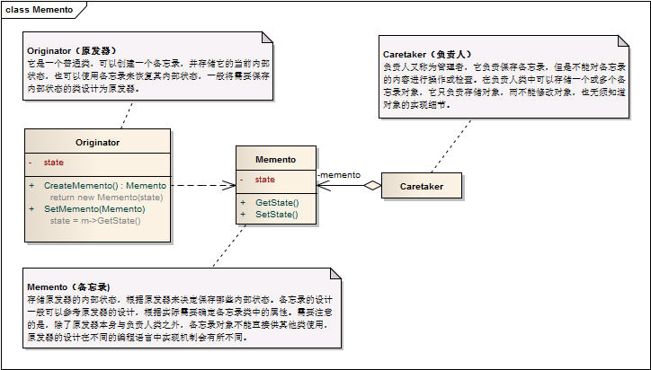

备忘录模式 ```Memento``` 
==================================================


## 真实案例

以计算器(原发器)为例, 当你做了一组运算后, 最后一次计算过程会保存在内存(备忘录)中. 所以你随时可以通过某个按钮(负责人)来恢复该操作.


## 模式定义

在不破坏封装的前提下，捕获一个对象的内部状态，并在该对象之外保存这个状态，这样可以在以后将对象恢复到原先保存的状态。它是一种对象行为型模式，其别名为Token。


## 模式UML



## 模式角色

- Originator（原发器）

    它是一个普通类，可以创建一个备忘录，并存储它的当前内部状态，也可以使用备忘录来恢复其内部状态，一般将需要保存内部状态的类设计为原发器。

- Memento（备忘录)

    存储原发器的内部状态，根据原发器来决定保存哪些内部状态。备忘录的设计一般可以参考原发器的设计，根据实际需要确定备忘录类中的属性。需要注意的是，除了原发器本身与负责人类之外，备忘录对象不能直接供其他类使用，原发器的设计在不同的编程语言中实现机制会有所不同。

- Caretaker（负责人）

    负责人又称为管理者，它负责保存备忘录，但是不能对备忘录的内容进行操作或检查。在负责人类中可以存储一个或多个备忘录对象，它只负责存储对象，而不能修改对象，也无须知道对象的实现细节。

注意事项：

由于在备忘录中存储的是原发器的中间状态，因此需要防止原发器以外的其他对象访问备忘录，特别是不允许其他对象来修改备忘录。所以在设计备忘录类时需要考虑其封装性，除了Originator类，不允许其他类来调用备忘录类Memento的构造函数与相关方法，如果不考虑封装性，允许其他类调用，将导致在备忘录中保存的历史状态发生改变，通过撤销操作所恢复的状态就不再是真实的历史状态，备忘录模式也就失去了本身的意义。


## 使用场景

保存一个对象在某一个时刻的全部状态或部分状态，这样以后需要时它能够恢复到先前的状态，实现撤销操作。

防止外界对象破坏一个对象历史状态的封装性。


## 代码实现

[备忘录模式](../../project/lib/src/main/java/com/dodo/patterns/behavioral/memento/)