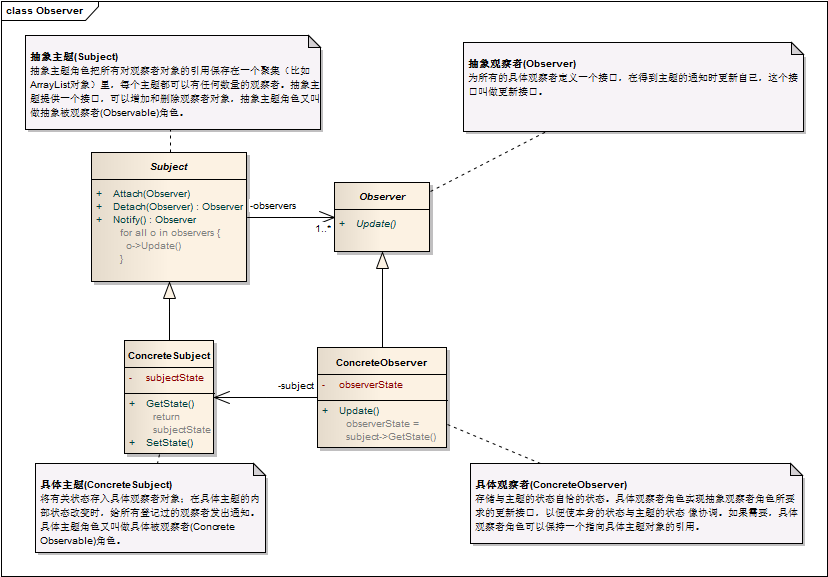

观察者模式 ```Observer``` 
==================================================


## 真实案例

一个好例子: 求职者订阅了某职位发布网站, 当有何时的职位出现时, 他们会收到通知.


## 模式定义

定义对象之间的一种一对多依赖关系，使得每当一个对象状态发生改变时，其相关依赖对象皆得到通知并被自动更新。观察者模式的别名包括发布-订阅（Publish/Subscribe）模式、模型-视图（Model/View）模式、源-监听器（Source/Listener）模式或从属者（Dependents）模式。观察者模式是一种对象行为型模式。


## 模式UML




## 模式角色

- 抽象主题(Subject)

    抽象主题角色把所有对观察者对象的引用保存在一个聚集（比如ArrayList对象）里，每个主题都可以有任何数量的观察者。抽象主题提供一个接口，可以增加和删除观察者对象，抽象主题角色又叫做抽象被观察者(Observable)角色。

- 具体主题(ConcreteSubject)

    将有关状态存入具体观察者对象；在具体主题的内部状态改变时，给所有登记过的观察者发出通知。具体主题角色又叫做具体被观察者(Concrete Observable)角色。

- 抽象观察者(Observer)

    为所有的具体观察者定义一个接口，在得到主题的通知时更新自己，这个接口叫做更新接口。

- 具体观察者(ConcreteObserver)

    存储与主题的状态自恰的状态。具体观察者角色实现抽象观察者角色所要求的更新接口，以便使本身的状态与主题的状态 像协调。如果需要，具体观察者角色可以保持一个指向具体主题对象的引用。


## 使用场景

一个抽象模型有两个方面，其中一个方面依赖于另一个方面，将这两个方面封装在独立的对象中使它们可以各自独立地改变和复用。

一个对象的改变将导致一个或多个其他对象也发生改变，而并不知道具体有多少对象将发生改变，也不知道这些对象是谁。

需要在系统中创建一个触发链，A对象的行为将影响B对象，B对象的行为将影响C对象……，可以使用观察者模式创建一种链式触发机制。


## 代码实现

[观察者模式](../../project/lib/src/main/java/com/dodo/patterns/behavioral/observer/)