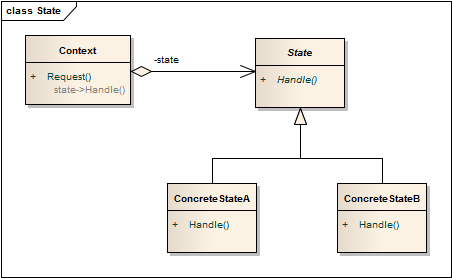

状态模式 ```State``` 
==================================================


## 真实案例

假设你正在使用"画图"程序，选择了画笔工具来进行绘制。画刷会根据你选择的颜色而改变其行为：譬如你选择了红色，它便会用红色来绘制；如果选择了蓝色，它将成为蓝色。


## 模式定义

允许一个对象在其内部状态改变时改变它的行为，对象看起来似乎修改了它的类。其别名为状态对象(Objects for States)，状态模式是一种对象行为型模式。


## 模式UML




## 模式角色

- Context（环境类）

    环境类又称为上下文类，它是拥有多种状态的对象。由于环境类的状态存在多样性且在不同状态下对象的行为有所不同，因此将状态独立出去形成单独的状态类。在环境类中维护一个抽象状态类State的实例，这个实例定义当前状态，在具体实现时，它是一个State子类的对象。

- State（抽象状态类）

    它用于定义一个接口以封装与环境类的一个特定状态相关的行为，在抽象状态类中声明了各种不同状态对应的方法，而在其子类中实现类这些方法，由于不同状态下对象的行为可能不同，因此在不同子类中方法的实现可能存在不同，相同的方法可以写在抽象状态类中。

- ConcreteState（具体状态类）

    它是抽象状态类的子类，每一个子类实现一个与环境类的一个状态相关的行为，每一个具体状态类对应环境的一个具体状态，不同的具体状态类其行为有所不同。


## 使用场景

对象的行为依赖于它的某些属性值，状态的改变将导致行为的变化。

在代码中包含大量与对象状态有关的条件语句，这些条件语句的出现，会导致代码的可维护性和灵活性变差，不能方便地增加和删除状态，并且导致客户类与类库之间的耦合增强。


## 代码实现

[状态模式](../../project/lib/src/main/java/com/dodo/patterns/behavioral/state/)