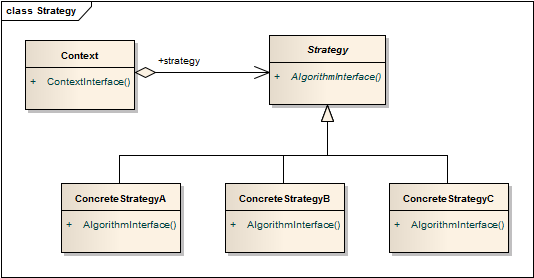

策略模式 ```Strategy``` 
==================================================


## 真实案例

以排序算法为例，最初我们采用冒泡排序，但随着数据数量的增长，冒泡排序越来越慢。为了解决这个问题，我们改用快速排序。但虽然对于大型数据集来说效果好了起来，但对于比较小的数据集而言，却相当慢。为了处理这样一个两难，我们采取了一个策略：对于小型数据集，采用冒泡排序；对于较大一些的，采用快速排序。


## 模式定义

定义一系列算法类，将每一个算法封装起来，并让它们可以相互替换，策略模式让算法独立于使用它的客户而变化，也称为政策模式(Policy)。策略模式是一种对象行为型模式。


## 模式UML




## 模式角色

- Context（环境类）

    环境类是使用算法的角色，它在解决某个问题（即实现某个方法）时可以采用多种策略。在环境类中维持一个对抽象策略类的引用实例，用于定义所采用的策略。

- Strategy（抽象策略类）

    它为所支持的算法声明了抽象方法，是所有策略类的父类，它可以是抽象类或具体类，也可以是接口。环境类通过抽象策略类中声明的方法在运行时调用具体策略类中实现的算法。

- ConcreteStrategy（具体策略类）

    它实现了在抽象策略类中声明的算法，在运行时，具体策略类将覆盖在环境类中定义的抽象策略类对象，使用一种具体的算法实现某个业务处理。


## 使用场景

一个系统需要动态地在几种算法中选择一种，那么可以将这些算法封装到一个个的具体算法类中，而这些具体算法类都是一个抽象算法类的子类。换言之，这些具体算法类均有统一的接口，根据“里氏代换原则”和面向对象的多态性，客户端可以选择使用任何一个具体算法类，并只需要维持一个数据类型是抽象算法类的对象。

一个对象有很多的行为，如果不用恰当的模式，这些行为就只好使用多重条件选择语句来实现。此时，使用策略模式，把这些行为转移到相应的具体策略类里面，就可以避免使用难以维护的多重条件选择语句。

不希望客户端知道复杂的、与算法相关的数据结构，在具体策略类中封装算法与相关的数据结构，可以提高算法的保密性与安全性。


## 代码实现

[策略模式](../../project/lib/src/main/java/com/dodo/patterns/behavioral/strategy/)