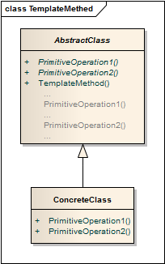

模板方法 ```Template Methed``` 
==================================================


## 真实案例

假设我们正在造房子, 其步骤看起来可能如下所示:

1. 建造地基
2. 砌墙
3. 建造屋顶
4. 隔出楼层

这些步骤的顺序是固定的, 即在砌墙之前不能建造屋顶, 但每个步骤都可以修改完善, 譬如砌墙也可以由木头或聚酯, 石头来替代.

简言之：模板方法定义了如何执行某种算法的框架, 但将具体实现延迟到子类.


## 模式定义

定义一个操作中算法的框架，而将一些步骤延迟到子类中。模板方法模式使得子类可以不改变一个算法的结构即可重定义该算法的某些特定步骤。


## 模式UML




## 模式角色

- AbstractClass（抽象类）

    在抽象类中定义了一系列基本操作(PrimitiveOperations)，这些基本操作可以是具体的，也可以是抽象的，每一个基本操作对应算法的一个步骤，在其子类中可以重定义或实现这些步骤。同时，在抽象类中实现了一个模板方法(Template Method)，用于定义一个算法的框架，模板方法不仅可以调用在抽象类中实现的基本方法，也可以调用在抽象类的子类中实现的基本方法，还可以调用其他对象中的方法。所以模板方法模式中的抽象层只能是抽象类，而不是接口。

- ConcreteClass（具体子类）

    它是抽象类的子类，用于实现在父类中声明的抽象基本操作以完成子类特定算法的步骤，也可以覆盖在父类中已经实现的具体基本操作。


## 使用场景

对一些复杂的算法进行分割，将其算法中固定不变的部分设计为模板方法和父类具体方法，而一些可以改变的细节由其子类来实现。

各子类中公共的行为应被提取出来并集中到一个公共父类中以避免代码重复。

需要通过子类来决定父类算法中某个步骤是否执行，实现子类对父类的反向控制。


## 代码实现

[模板方法](../../project/lib/src/main/java/com/dodo/patterns/behavioral/templatemethed/)