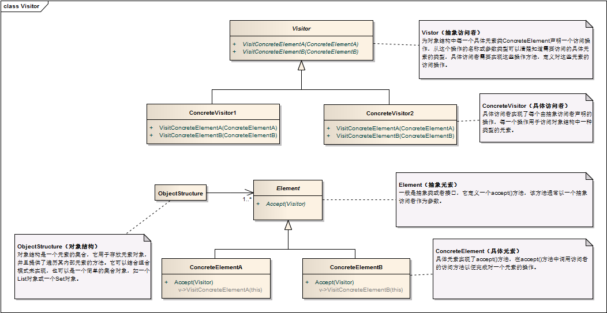

访问者模式 ```Visitor``` 
==================================================


## 真实案例

假设有人要去迪拜，他只需要一种方式(例如签证)进入迪拜。到了之后，就可以去访问迪拜的任何地方，而用不着额外申请许可，或是做一些法律事宜。只需要让他知道一个地方，他就可以去访问了。访问者模式可以做到这一点，它帮助你添加地点，以便你无需额外工作就可以尽可能的访问更多地方。


## 模式定义

提供一个作用于某对象结构中的各元素的操作表示，它使我们可以在不改变各元素的类的前提下定义作用于这些元素的新操作。访问者模式是一种对象行为型模式。


## 模式UML




## 模式角色

- Vistor（抽象访问者）

    为对象结构中每一个具体元素类ConcreteElement声明一个访问操作，从这个操作的名称或参数类型可以清楚知道需要访问的具体元素的类型，具体访问者需要实现这些操作方法，定义对这些元素的访问操作。

- ConcreteVisitor（具体访问者）

    具体访问者实现了每个由抽象访问者声明的操作，每一个操作用于访问对象结构中一种类型的元素。

- Element（抽象元素）

    一般是抽象类或者接口，它定义一个accept()方法，该方法通常以一个抽象访问者作为参数。

- ConcreteElement（具体元素）

    具体元素实现了accept()方法，在accept()方法中调用访问者的访问方法以便完成对一个元素的操作。

- ObjectStructure（对象结构）

    对象结构是一个元素的集合，它用于存放元素对象，并且提供了遍历其内部元素的方法。它可以结合组合模式来实现，也可以是一个简单的集合对象，如一个List对象或一个Set对象。


## 使用场景

一个对象结构包含多个类型的对象，希望对这些对象实施一些依赖其具体类型的操作。在访问者中针对每一种具体的类型都提供了一个访问操作，不同类型的对象可以有不同的访问操作。

需要对一个对象结构中的对象进行很多不同的并且不相关的操作，而需要避免让这些操作“污染”这些对象的类，也不希望在增加新操作时修改这些类。访问者模式使得我们可以将相关的访问操作集中起来定义在访问者类中，对象结构可以被多个不同的访问者类所使用，将对象本身与对象的访问操作分离。

对象结构中对象对应的类很少改变，但经常需要在此对象结构上定义新的操作。


## 代码实现

[访问者模式](../../project/lib/src/main/java/com/dodo/patterns/behavioral/visitor/)