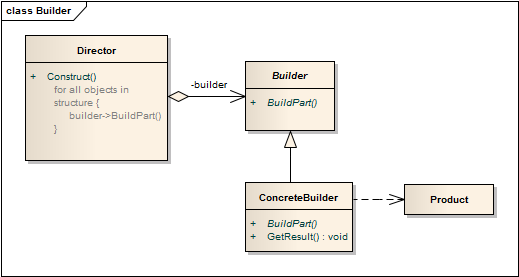

生成器模式 ```Builder``` 
==================================================


## 真实案例

假设你在哈迪斯(美国连锁快餐集团)，正想下单。 如果你说，要一个 "大哈迪"，他们很快就能交给你，而不多问一句。这是简单工厂的例子。 但，当创建逻辑涉及更多步骤时，譬如，你在 Subway 买汉堡，那么你可能需要做出更多选择，想要哪种面包？ 哪种酱汁？哪种奶酪？这种情况下，就需要用到生成器模式了。

简言之：允许你创建不同风格的对象，同时避免构造器污染。当对象有好几种口味的时候尤其有用。或者是创建对象的过程涉及很多步骤时。


## 模式定义

将一个复杂对象的构建与它的表示分离，使得同样的构建过程可以创建不同的表示。建造者模式是一种对象创建型模式。


## 模式UML




## 模式角色

- Builder（抽象建造者）

    它为创建一个产品对象的各个部件指定抽象接口，在该接口中一般声明两类方法，一类方法是buildXXX()，它们用于创建复杂对象的各个部件；另一类方法是getXXX()，它们用于返回复杂对象。Builder既可以是抽象类，也可以是接口。

- ConcreteBuilder（具体建造者）

    它实现了Builder接口，实现各个部件的具体构造和装配方法，定义并明确它所创建的复杂对象，也可以提供一个方法返回创建好的复杂产品对象。

- Product（产品角色）

    它是被构建的复杂对象，包含多个组成部件，具体建造者ConcreteBuilder创建该产品的内部表示并定义它的装配过程。

- Director（指挥者）

    指挥者又称为导演类，它负责安排复杂对象的建造次序，指挥者与抽象建造者之间存在关联关系，可以在其construct()建造方法中调用建造者对象的部件构造与装配方法，完成复杂对象的建造。客户端一般只需要与指挥者进行交互，在客户端确定具体建造者的类型，并实例化具体建造者对象，然后通过指挥者类的构造函数或者Setter方法将该对象传入指挥者类中。


什么是复杂对象：是指那些包含多个成员属性的对象，这些成员属性也称为部件或零件，如程序猿要会识字、会数学、会编程语言，会设计模式等等。


## 使用场景

需要生成的产品对象有复杂的内部结构，每一个内部成分本身可以是对象，也可以仅仅是一个对象的一个组成部分。

需要生成的产品对象的属性相互依赖。建造模式可以强制实行一种分步骤进行的建造过程，因此，如果产品对象的一个属性必须在另一个属性被赋值之后才可以被赋值，使用建造模式是一个很好的设计思想。

在对象创建过程中会使用到系统中的其他一些对象，这些对象在产品对象的创建过程中不易得到。


## 代码实现

[生成器模式](../../project/lib/src/main/java/com/dodo/patterns/creational/builder/)