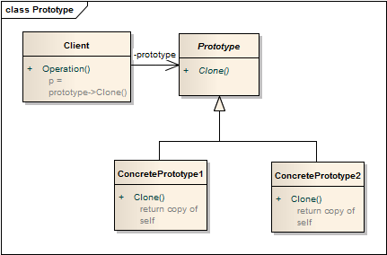

原型模式 ```Prototype``` 
==================================================


## 真实案例

还记得多利吗？这个山羊是克隆的！先不谈细节，关键点都集中在于克隆上。

简言之：通过克隆, 基于已有对象来创建对象。


## 模式定义

使用原型实例指定创建对象的种类，并且通过拷贝这些原型创建新的对象。原型模式是一种对象创建型模式。


## 模式UML




## 模式角色

- 实现Cloneable接口

    在java语言有一个Cloneable接口，它的作用只有一个，就是在运行时通知虚拟机可以安全地在实现了此接口的类上使用clone方法。在java虚拟机中，只有实现了这个接口的类才可以被拷贝，否则在运行时会抛出CloneNotSupportedException异常。

- 重写Object类中的clone方法

    Java中，所有类的父类都是Object类，Object类中有一个clone方法，作用是返回对象的一个拷贝，但是其作用域protected类型的，一般的类无法调用，因此，Prototype类需要将clone方法的作用域修改为public类型。


## 使用场景

创建新对象成本较大（如初始化需要占用较长的时间，占用太多的CPU资源或网络资源），新的对象可以通过原型模式对已有对象进行复制来获得，如果是相似对象，则可以对其成员变量稍作修改。

如果系统要保存对象的状态，而对象的状态变化很小，或者对象本身占用内存较少时，可以使用原型模式配合备忘录模式来实现。

需要避免使用分层次的工厂类来创建分层次的对象，并且类的实例对象只有一个或很少的几个组合状态，通过复制原型对象得到新实例可能比使用构造函数创建一个新实例更加方便。


## 代码实现

[原型模式](../../project/lib/src/main/java/com/dodo/patterns/creational/prototype/)