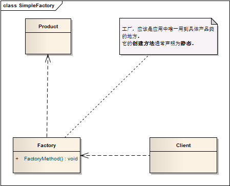

简单工厂模式 ```Simple Factory``` 
==================================================


## 真实案例

造房子时需要一个门。你是穿上木匠服开始在你家门口锯木头，搞得一团糟；还是从工厂里生产一个。

简言之：简单工厂为用户提供了一个实例，而隐藏了具体的实例化逻辑。


## 模式定义

定义一个工厂类，它可以根据参数的不同返回不同类的实例，被创建的实例通常都具有共同的父类。

因为在简单工厂模式中用于创建实例的方法是静态(static)方法，因此简单工厂模式又被称为静态工厂方法(Static Factory Method)模式。

**切记：** ```简单工厂模式不属于设计模式，是一种编码的习惯，但他又和工厂模式有些关系```。


## 模式UML




## 模式角色

- Factory（工厂角色）

    工厂角色即工厂类，它是简单工厂模式的核心，负责实现创建所有产品实例的内部逻辑；工厂类可以被外界直接调用，创建所需的产品对象；在工厂类中提供了静态的工厂方法，返回类型为抽象产品类型。

- Product（抽象产品角色）

    工厂类所创建的所有对象的父类，封装了各种产品对象的公有方法，它的引入将提高系统的灵活性，使得在工厂类中只需定义一个通用的工厂方法，因为所有创建的具体产品对象都是其子类对象。

- ConcreteProduct（具体产品角色）

    简单工厂模式的创建目标，所有被创建的对象都充当这个角色的某个具体类的实例。每一个具体产品角色都继承了抽象产品角色，需要实现在抽象产品中声明的抽象方法。


特例： 有时候，为了简化简单工厂模式，我们可以将抽象产品类和工厂类合并，将静态工厂方法移至抽象产品类中。


在简单工厂模式中，客户端通过工厂类来创建一个产品类的实例，而无须直接使用new关键字来创建对象。


## 使用场景

工厂类负责创建的对象比较少。

客户端只知道传入工厂类的参数，对于如何创建对象并不关心。


## 代码实现

[简单工厂模式](../../project/lib/src/main/java/com/dodo/patterns/creational/factory/simplefactory/)