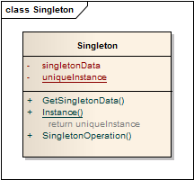

单例模式 ```Singleton``` 
==================================================


## 真实案例

所谓一山不容二虎，一国不可两君。遇到大事，总应该由同一位老大来处理。那么这位老大就是单例。

简言之：确保一个特定类的一个对象, 只能创建一次。


## 模式定义

确保某一个类只有一个实例，而且自行实例化并向整个系统提供这个实例，这个类称为单例类，它提供全局访问的方法。单例模式是一种对象创建型模式。


## 模式UML




## 模式角色

- 私有构造方法

    指向自己实例的私有静态引用

- 以自己实例为返回值的静态的公有的方法


模式：

根据实例化对象时机不同分为懒汉模式与饿汉模式。饿汉模式是单例类被加载时候就实例化一个对象交给自己的引用；懒汉模式时在调用取得实例方法的时候才会实例化对象。

记忆小技巧：饿汉模式（E）-加载类初始化实例化（先），懒汉模式（L）-调运实例初始化（后）；所以E先L后，依据字母表顺序记忆即可。


## 使用场景

- 系统只需要一个实例对象。

- 需要频繁实例化且销毁的对象。

- 创建对象时耗时过多或者耗资源过多，但又经常用到的对象。

- 有状态的对象。

- 频繁访问数据库或文件的对象。


## 代码实现

[单例模式](../../project/lib/src/main/java/com/dodo/patterns/creational/singleton/)

