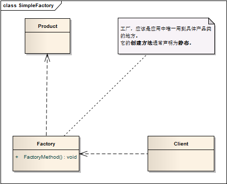

工厂设计模式
==================================================


> 以下内容主要整理自 http://pushmind.org/2017/07/31/design-patterns-for-humans/


> 造房子时需要一个门，你是穿上木匠服开始在你家门口锯木头，搞得一团糟？还是从工厂里生产一个？


依赖倒置原则，指导我们避免依赖具体类型，而要尽量依赖抽象。所有的工厂都是用来封装对象的创建，以便将代码从具体类解耦。


我们把三个工厂理一遍：

- 简单工厂，是针对一种“类型”的抽象。
- 工厂方法，是针对一种“类型”，以及一种“创建方法”的抽象。
- 抽象工厂，是针对一组“类型”与“创建方法”的抽象，组内每一套类型与创建方法一一对应。

用造门这个例子来说：

- 简单工厂，是封装了“造门”的操作，输出的是一种门。
- 工厂方法，是封装了“多种造门”的操作，并委托“多家工厂”，输出的是“各种门”。
- 抽象工厂，是封装了“多种造门”的操作，“提供多种专业人员”的操作，并委托给“多家工厂”，输出的是“各种门”，以及“各种专业人员”，且“门”与“专业人员”一一对应。

附客户端调用的代码：

- [简单工厂](../project/lib/src/main/java/com/dodo/patterns/creational/factory/simplefactory/)

```java
$door = DoorFactory::makeDoor(100, 200); // 客户不需要先指定委托对象。传递门宽高，输出一种规格的门
```

- [工厂方法](../project/lib/src/main/java/com/dodo/patterns/creational/factory/factorymethod/)
        
```java
// 木门
$woodenDoorManager = new WoodenDoorManager();
$door = $woodenDoorManager->makeDoor(100, 200);

// 铁门
$ironDoorManager = new IronDoorManager();
$door = $ironDoorManager->makeDoor(100, 200); // 客户需要先指定委托对象。委托给*DoorManager，输出"各种门"
```

- [抽象工厂](../project/lib/src/main/java/com/dodo/patterns/creational/factory/abstractfactory/)

```java
// 木门
$woodenFactory = new WoodenDoorFactory();
$door = $woodenFactory->makeDoor();  // 输出门
$expert = $woodenFactory->makeFittingExpert(); // 还输出专业人员，且"门"与"专业人员"一一对应。
$door->getDescription();
$expert->getDescription();

// 铁门
$ironFactory = new IronDoorFactory();
$door = $ironFactory->makeDoor();
$expert = $ironFactory->makeFittingExpert();
$door->getDescription();
$expert->getDescription(); // 多种造门。委托给"多家工厂"，输出"各种门"。且"门"与"专业人员"一一对应。

```

附分别的UML图：
- [简单工厂](creational/SimpleFactory.md)
> 定义一个工厂类，它可以根据参数的不同返回不同类的实例，被创建的实例通常都具有共同的父类。



- [工厂方法](creational/FactoryMethod.md)
> 定义一个用于创建对象的接口，让子类决定将哪一个类实例化。工厂方法模式让一个类的实例化延迟到其子类。


- [抽象工厂](creational/AbstractFactory.md)
> 提供一个创建一系列相关或相互依赖对象的接口，而无须指定它们具体的类。


工厂方法和简单工厂有啥区别？

**两者最大的区别：抽象的维度。**

- 简单工厂的抽象，是一维的，它抽象的仅仅是所创建"类型"的接口；
- 而工厂方法的抽象，是二维的，它不仅抽象了所创建"类型"的接口，而且抽象了"方法"的接口。

具体到例子里，简单工厂实例中，客户就是要一个门, 而不关心创建过程, 最后实际创造的是一个木门。这个颇为讽刺，如果客户要的是个铁门呢？那就事与愿违了。

所以在这个例子里, 也是存在两维抽象的。一是"门"这个类型的抽象，二是"造门"这个方法的抽象。简单工厂只做到了前者，而没有给出后者的解决方案，这才造成了客户可能吃了哑巴亏。

如果我们按照工厂方法的思路，将门工厂造门这件事进行细分，木门交给木门工厂，铁门交给铁门工厂。这就和工厂方法里的例子别无二致了。客户需要先指定委托对象，而不关心具体怎么造门。


简单工厂和抽象工厂有啥区别？

**依然可以用维度来理解抽象工厂。 抽象工厂比工厂方法又多了一维。**

例子中，抽象工厂提供了两套“类型 - 创建操作”（分别是"门 - 造门"，"专业人员 - 提供专业人员"），其实这个个数是无限的。

你可以提供 n 套这样的对应关系，然后委托给相关的工厂。这就是“工厂们的工厂”的具体含义。


> 关于我 [https://github.com/dodosss/design_patterns](https://github.com/dodosss/design_patterns)