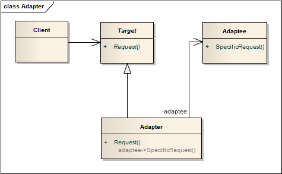

适配器模式 ```Adapter``` 
==================================================


## 真实案例
 三个例子:

 1) 你从相机存储卡传照片给电脑，需要与此兼容的适配器，来保证连接。

 2) 电源适配器，三脚插头转两脚插头。

 3) 翻译, 看好莱坞大片, 将英文字幕转为中文。


## 模式定义
将一个接口转换成客户希望的另一个接口，使接口不兼容的那些类可以一起工作，其别名为包装器(Wrapper)。适配器模式既可以作为类结构型模式，也可以作为对象结构型模式。

## 模式UML


## 模式角色
根据适配器类与适配者类的关系不同，适配器模式可分为对象适配器和类适配器两种。在对象适配器模式中，适配器与适配者之间是关联关系；在类适配器模式中，适配器与适配者之间是继承（或实现）关系。

#### 对象适配器模式结构重要核心模块：

- 目标接口（Target）

    客户所期待的接口。目标可以是具体的或抽象的类，也可以是接口。

- 需要适配的类（Adaptee）

    需要适配的类或适配者类。

- 适配器（Adapter）

    通过包装一个需要适配的对象，把原接口转换成目标接口。　　

#### 类适配器模式结构重要核心模块：

- 目标接口（Target）

    客户所期待的接口。目标是接口。

- 需要适配的类（Adaptee）

    需要适配的类或适配者类。

- 适配器（Adapter）

    适配器类实现了抽象目标类接口Target，并继承了适配者类Adaptee。


类适配器模式中如果适配者Adapter为最终(Final)类，也无法使用类适配器。在Java等面向对象编程语言中，大部分情况下我们使用的是对象适配器，类适配器较少使用。


## 使用场景

系统需要使用现有的类，而这些类的接口不符合系统的接口。

想要建立一个可以重用的类，用于与一些彼此之间没有太大关联的一些类，包括一些可能在将来引进的类一起工作。

两个类所做的事情相同或相似，但是具有不同接口的时候。

旧的系统开发的类已经实现了一些功能，但是客户端却只能以另外接口的形式访问，但我们不希望手动更改原有类的时候。

使用第三方组件，组件接口定义和自己定义的不同，不希望修改自己的接口，但是要使用第三方组件接口的功能。


## 代码实现

[适配器模式](../../project/lib/src/main/java/com/dodo/patterns/structural/adapter/)