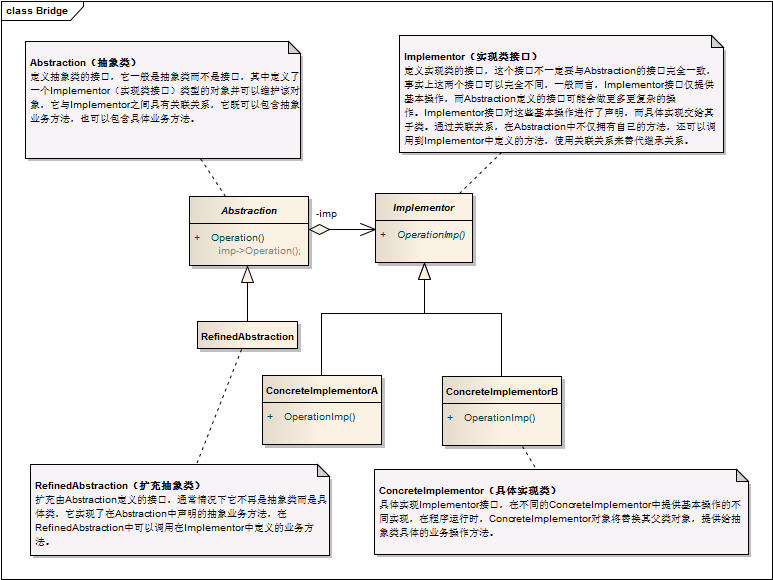

桥接模式 ```Bridge``` 
==================================================


## 真实案例
如果你有一个网站，有着很多不同种类的页面。 而此刻你有一个功能是允许用户来改变主题样式。该怎么做？为每个不同页面都创建多个副本？还是创建单独的主题，并根据用户偏好加载它们？桥接模式允许你实现第二种方案。


## 模式定义
将抽象部分与它的实现部分分离，使它们都可以独立地变化。它是一种对象结构型模式，又称为柄体(Handle and Body)模式或接口(Interface)模式。


## 模式UML



## 模式角色
- Abstraction（抽象类）

    定义抽象类的接口，它一般是抽象类而不是接口，其中定义了一个Implementor（实现类接口）类型的对象并可以维护该对象，它与Implementor之间具有关联关系，它既可以包含抽象业务方法，也可以包含具体业务方法。

- RefinedAbstraction（扩充抽象类）

    扩充由Abstraction定义的接口，通常情况下它不再是抽象类而是具体类，它实现了在Abstraction中声明的抽象业务方法，在RefinedAbstraction中可以调用在Implementor中定义的业务方法。

- Implementor（实现类接口）

    定义实现类的接口，这个接口不一定要与Abstraction的接口完全一致，事实上这两个接口可以完全不同，一般而言，Implementor接口仅提供基本操作，而Abstraction定义的接口可能会做更多更复杂的操作。Implementor接口对这些基本操作进行了声明，而具体实现交给其子类。通过关联关系，在Abstraction中不仅拥有自己的方法，还可以调用到Implementor中定义的方法，使用关联关系来替代继承关系。

- ConcreteImplementor（具体实现类）

    具体实现Implementor接口，在不同的ConcreteImplementor中提供基本操作的不同实现，在程序运行时，ConcreteImplementor对象将替换其父类对象，提供给抽象类具体的业务操作方法。


## 使用场景
如果一个系统需要在抽象化和具体化之间增加更多的灵活性，避免在多个层次之间建立静态的继承关系，通过桥接模式可以使它们在抽象层建立一个关联关系。

“抽象部分”和“实现部分”可以以继承的方式独立扩展而互不影响，在程序运行时可以动态将一个抽象化子类的对象和一个实现化子类的对象进行组合，即系统需要对抽象化角色和实现化角色进行动态耦合。

一个类存在两个（或多个）独立变化的维度，且这两个（或多个）维度都需要独立进行扩展。

对于那些不希望使用继承或因为多层继承导致系统类的个数急剧增加的系统，桥接模式尤为适用。


## 代码实现

[桥接模式](../../project/lib/src/main/java/com/dodo/patterns/structural/bridge/)