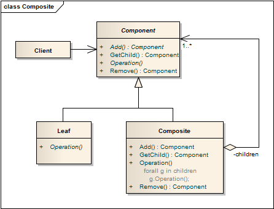

组合模式 ```Composite``` 
==================================================


## 真实案例
每个公司都是由员工组成的。每个员工，有相同点：如都有薪水， 都需要负责，都可能有上级，也都可能有下属。


## 模式定义
组合多个对象形成树形结构以表示具有“整体—部分”关系的层次结构。组合模式对单个对象（即叶子对象）和组合对象（即容器对象）的使用具有一致性，组合模式又可以称为“整体—部分”(Part-Whole)模式，它是一种对象结构型模式。


## 模式UML



## 模式角色
- 抽象构件（Component）

    组合中的对象声明接口，在适当的情况下实现所有类共有接口的默认行为。声明一个接口用于访问和管理Component子部件。

- 树叶构件（Leaf）

    在组合中表示树的叶子结点对象，叶子结点没有子结点。

- 容器构件（Composite）

    定义有枝节点的部件，在Component接口中实现与子部件有关操作，如增加(add)和删除(remove)等。


组合模式的关键是定义一个抽象构件类，它既可以代表Leaf，又可以代表Composite，而客户端针对该抽象构件类进行编程，无须知道它到底表示的是叶子还是容器，可以对其进行统一处理。同时容器对象与抽象构件类之间还建立一个聚合关联关系，在容器对象中既可以包含叶子，也可以包含容器，以此实现递归组合，形成一个树形结构。


## 使用场景
在具有整体和部分的层次结构中，希望通过一种方式忽略整体与部分的差异，客户端可以一致地对待它们。

在一个使用面向对象语言开发的系统中需要处理一个树形结构。

在一个系统中能够分离出叶子对象和容器对象，而且它们的类型不固定，需要增加一些新的类型。


## 代码实现

[组合模式](../../project/lib/src/main/java/com/dodo/patterns/structural/composite/)