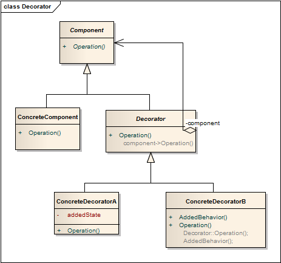

装饰模式 ```Decorator``` 
==================================================


## 真实案例
假设你经营一家提供多种服务的汽车服务店。你如何来计算收费账单？通常会选择一项服务的同时，动态更新服务的总价。这里, 每一种服务都是装饰器。


## 模式定义
 动态地给一个对象增加一些额外的职责，就增加对象功能来说，装饰模式比生成子类实现更为灵活。装饰模式是一种对象结构型模式。


## 模式UML



## 模式角色
- Component（抽象构件）

    它是具体构件和抽象装饰类的共同父类，声明了在具体构件中实现的业务方法，它的引入可以使客户端以一致的方式处理未被装饰的对象以及装饰之后的对象，实现客户端的透明操作。

- ConcreteComponent（具体构件）

    它是抽象构件类的子类，用于定义具体的构件对象，实现了在抽象构件中声明的方法，装饰器可以给它增加额外的职责（方法）。

- Decorator（抽象装饰类）

    它也是抽象构件类的子类，用于给具体构件增加职责，但是具体职责在其子类中实现。它维护一个指向抽象构件对象的引用，通过该引用可以调用装饰之前构件对象的方法，并通过其子类扩展该方法，以达到装饰的目的。

- ConcreteDecorator（具体装饰类）

    它是抽象装饰类的子类，负责向构件添加新的职责。每一个具体装饰类都定义了一些新的行为，它可以调用在抽象装饰类中定义的方法，并可以增加新的方法用以扩充对象的行为。


注意事项：装饰者模式使用时需要注意以下几个问题：

- 尽量保持装饰类的接口与被装饰类的接口相同，这样，对于客户端而言，无论是装饰之前的对象还是装饰之后的对象都可以一致对待。这也就是说，在可能的情况下，我们应该尽量使用透明装饰模式。

- 尽量保持具体装饰类是一个“轻”类，也就是说不要把太多的行为放在具体构件类中，我们可以通过装饰类对其进行扩展。

- 如果只有一个具体构件类，那么抽象装饰类可以作为该具体构件类的直接子类。 


## 使用场景
在不影响其他对象的情况下，以动态、透明的方式给单个对象添加职责。

当不能采用继承的方式对系统进行扩展或者采用继承不利于系统扩展和维护时可以使用装饰模式。

不能采用继承的情况主要有系统中存在大量独立的扩展，为支持每一种扩展或者扩展之间的组合将产生大量的子类，使得子类数目呈爆炸性增长；类已定义为不能被继承（譬如final类）。


## 代码实现

[装饰模式](../../project/lib/src/main/java/com/dodo/patterns/structural/decorator/)