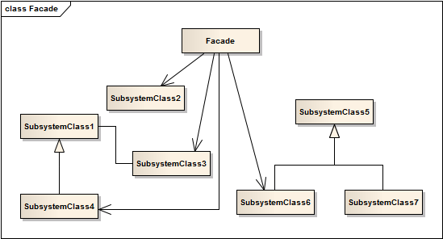

外观模式 ```Facade``` 
==================================================


## 真实案例
如何开机？你会说“按一下电源键”。 你会有这样的反应，是因为计算机提供了一个超级简单的接口，而隐藏了一系列复杂的开机操作所致。这个简单接口，对于复杂操作来说，就是外观。


## 模式定义
为子系统中的一组接口提供一个统一的入口。外观模式定义了一个高层接口，这个接口使得这一子系统更加容易使用。


## 模式UML



## 模式角色
- 外观角色

    客户端可以调用它的方法，在外观角色中可以知道相关子系统的功能和责任；在正常情况下，它将所有从客户端发来的请求委派到相应的子系统去，传递给相应的子系统对象处理。

- 子系统角色

    在软件系统中可以有一个或者多个子系统角色，每一个子系统可以不是一个单独的类，而是一个类的集合，它实现子系统的功能；每一个子系统都可以被客户端直接调用，或者被外观角色调用，它处理由外观类传过来的请求；子系统并不知道外观的存在，对于子系统而言，外观角色仅仅是另外一个客户端而已。


## 使用场景
需要访问一系列复杂的子系统时提供一个简单入口。

客户端程序与多个子系统之间存在很大的依赖性。引入外观类可以将子系统与客户端解耦，从而提高子系统的独立性和可移植性。

在层次化结构中，可以使用外观模式定义系统中每一层的入口，层与层之间不直接产生联系，而通过外观类建立联系，降低层之间的耦合度。


## 代码实现

[外观模式](../../project/lib/src/main/java/com/dodo/patterns/structural/facade/)