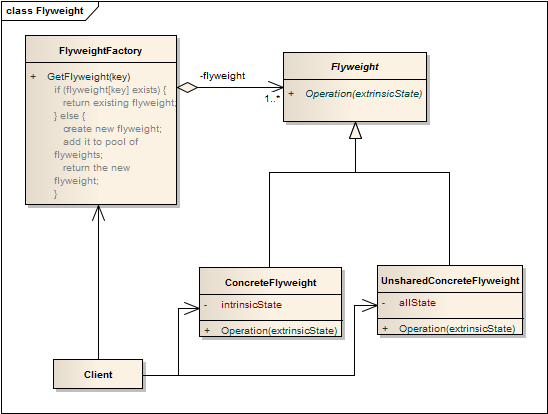

享元模式 ```Flyweight``` 
==================================================


## 真实案例
你有没有在摊位边喝现泡茶的体验？他们经常除了你要求的这一杯外，还额外沏更多的茶，留给其他的潜在客户。以此来节省资源，包括热气、火候等。享元模式就是针对这一特点的: 共享。

## 模式定义
运用共享技术有效地支持大量细粒度对象的复用。系统只使用少量的对象，而这些对象都很相似，状态变化很小，可以实现对象的多次复用。由于享元模式要求能够共享的对象必须是细粒度对象，因此它又称为轻量级模式，它是一种对象结构型模式。

## 模式UML


## 模式角色

### 享元模式分类：

- 单纯享元模式
- 复合享元模式


#### 单纯享元模式结构重要核心模块：

- 抽象享元角色

    为具体享元角色规定了必须实现的方法，而外部状态就是以参数的形式通过此方法传入。在Java中可以由抽象类、接口来担当。

- 具体享元角色

    实现抽象角色规定的方法。如果存在内部状态，就负责为内部状态提供存储空间。

- 享元工厂角色

负责创建和管理享元角色。要想达到共享的目的，这个角色的实现是关键！

- 客户端角色

    维护对所有享元对象的引用，而且还需要存储对应的外部状态。


单纯享元模式和创建型的简单工厂模式实现上非常相似，但是它的重点或者用意却和工厂模式截然不同。工厂模式的使用主要是为了使系统不依赖于实现得细节；而在享元模式的主要目的是避免大量拥有相同内容对象的开销。


#### 复合享元模式结构重要核心模块：

- 抽象享元角色

    为具体享元角色规定了必须实现的方法，而外部状态就是以参数的形式通过此方法传入。在Java中可以由抽象类、接口来担当。

- 具体享元角色

    实现抽象角色规定的方法。如果存在内部状态，就负责为内部状态提供存储空间。

- 复合享元角色

    它所代表的对象是不可以共享的，并且可以分解成为多个单纯享元对象的组合。

- 享元工厂角色

    负责创建和管理享元角色。要想达到共享的目的，这个角色的实现是关键！

- 客户端角色

    维护对所有享元对象的引用，而且还需要存储对应的外部状态。


## 使用场景
一个系统有大量相同或者相似的对象，造成内存的大量耗费。

对象的大部分状态都可以外部化，可以将这些外部状态传入对象中。

在使用享元模式时需要维护一个存储享元对象的享元池，而这需要耗费一定的系统资源，因此，应当在需要多次重复使用享元对象时才值得使用享元模式。


## 代码实现

[享元模式](../../project/lib/src/main/java/com/dodo/patterns/structural/flyweight/)