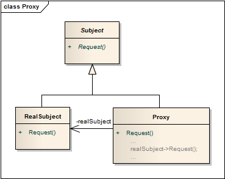

代理模式 ```Proxy``` 
==================================================


## 真实案例
你应该用过门禁卡开门吧？其实有很多种方式来开门，如用门禁卡，或是输入安全密码等等。门的主要功能本来只是"开"， 而现在门禁系统就像是加之于门的代理，使之拥有了更多的功能。


## 模式定义
给某一个对象提供一个代理或占位符，并由代理对象来控制对原对象的访问。


## 模式UML


## 模式角色
- Subject（抽象主题角色）

    它声明了真实主题和代理主题的共同接口，这样一来在任何使用真实主题的地方都可以使用代理主题，客户端通常需要针对抽象主题角色进行编程。

- Proxy（代理主题角色）

    它包含了对真实主题的引用，从而可以在任何时候操作真实主题对象；在代理主题角色中提供一个与真实主题角色相同的接口，以便在任何时候都可以替代真实主题；代理主题角色还可以控制对真实主题的使用，负责在需要的时候创建和删除真实主题对象，并对真实主题对象的使用加以约束。通常，在代理主题角色中，客户端在调用所引用的真实主题操作之前或之后还需要执行其他操作，而不仅仅是单纯调用真实主题对象中的操作。

- RealSubject（真实主题角色）

    它定义了代理角色所代表的真实对象，在真实主题角色中实现了真实的业务操作，客户端可以通过代理主题角色间接调用真实主题角色中定义的操作。


## 使用场景
代理模式的类型较多，不同类型的代理模式有不同的优缺点，它们应用于不同的场合：

- 当客户端对象需要访问远程主机中的对象时可以使用远程代理。

- 当需要用一个消耗资源较少的对象来代表一个消耗资源较多的对象，从而降低系统开销、缩短运行时间时可以使用虚拟代理，例如一个对象需要很长时间才能完成加载时。

- 当需要为某一个被频繁访问的操作结果提供一个临时存储空间，以供多个客户端共享访问这些结果时可以使用缓冲代理。通过使用缓冲代理，系统无须在客户端每一次访问时都重新执行操作，只需直接从临时缓冲区获取操作结果即可。

- 当需要控制对一个对象的访问，为不同用户提供不同级别的访问权限时可以使用保护代理。

- 当需要为一个对象的访问（引用）提供一些额外的操作时可以使用智能引用代理。


## 代码实现

[代理模式](../../project/lib/src/main/java/com/dodo/patterns/structural/proxy/)